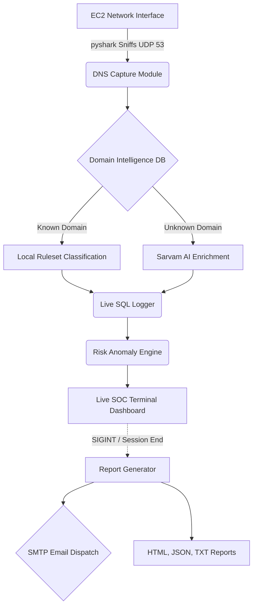

<div align="center">
  <h1>🛡️ OPTIMUS</h1>
  <p><b>Cloud-Native Interview Integrity & Live Monitoring SOC Platform</b></p>
  <i>A server-centric, headless Security Operations Center (SOC) dashboard that monitors, categorizes, enriches, and scores network anomalies in real-time.</i>
</div>

---

## 🚀 Overview

**Optimus** is an end-to-end monitoring platform built for high-stakes environments (e.g., remote interviews, secure perimeters). Running strictly natively on a single EC2 instance, it performs real-time DNS packet captures, processes traffic against local security databases, enriches unknown domains using **Sarvam AI**, and calculates a live **Risk Score**.

When the session ends, it automatically generates comprehensive **JSON, HTML, and TXT** reports and dispatches them via SMTP.

## ✨ Key Features

- **🦈 Native Packet Capture:** Uses `pyshark` for transparent, root-level network monitoring.
- **🧠 AI Enrichment pipeline:** Real-time domain resolution & contextual categorization utilizing the **Sarvam API**.
- **📊 Live SOC Dashboard:** Built with `Rich`, offering a terminal-based monitoring feed indicating Domain traffic, Threat Events, and dynamic Risk Metrics.
- **🛡️ Anomaly Engine:** Aggregates events like `DOMAIN_SWITCHING`, `AI_DOMAIN_BURST`, and unverified queries to generate an actionable 0-100 Risk Score.
- **📈 Automatic Automated Reporting:** Auto-wraps sessions on `SIGINT` (Ctrl+C), dumping beautifully formatted Dark Mode HTML reports, parsable JSON, and triggering proactive Admin SMTP email alerts.

---

## 🏗️ Core Architecture



## 🛠️ Environment Setup

Optimus has completely migrated to a pure cloud-native EC2 application (decommissioning legacy WireGuard/Electron desktop constraints).

### 1. Prerequisites 
Ensure you are running on an **Ubuntu EC2** instance and you have a python virtual environment set up.
```bash
# Create and activate a Virtual Environment
python3 -m venv venv
source venv/bin/activate

# Install strictly isolated requirements
pip install -r requirements.txt
```

### 2. Configuration (`.env`)
Create a `.env` file at the root of `Coadex-2.0` with the following variables:
```env
SARVAM_API_KEY=your_sarvam_key_here

# Automatic SMTP Reporting Configuration
SMTP_HOST=smtp.gmail.com
SMTP_PORT=587
SMTP_USER=your_bot_email@gmail.com
SMTP_PASS=your_gmail_app_password
SMTP_TO=admin_recipient@example.com
```

---

## 🎮 Running the Demonstration

### Step 1: Start Optimus (Security Root Required)
For packet capture interfaces, you must execute strictly under `sudo` while pointing to the virtual environment's python bin:

```bash
cd ~/Coadex-2.0
sudo ~/Coadex-2.0/venv/bin/python3 optimus.py
```
*You will immediately see the Live SOC Dashboard establish a session ID and wait for incoming packets.*

### Step 2: Triggering Anomalies (Second Terminal)
Open a new SSH session to the EC2 server to easily simulate target traffic:
```bash
nslookup chat.openai.com
nslookup claude.ai
nslookup stackoverflow.com
```
*Watch the live dashboard instantly intercept, categorize, and inflate the Risk Score based on AI queries vs. standard navigation!*

### Step 3: Concluding the Session
Back in the dashboard terminal, hit **`Ctrl+C`**.
Optimus elegantly handles the `SIGINT` signal, triggers its finalizers, and completes the SOC pipeline:
1. Shuts down the PCAP engine safely.
2. Dumps the session schema.
3. Generates the `reports/` payload (`.json`, `.txt`, `.html`).
4. Broadcasts the summary payload via the integrated SMTP Alerting service.

---

## 📁 Repository Map

```text
Coadex-2.0/
├── optimus.py                     # 🌟 Main Application & Live Dash Entrypoint
├── backend/
│   ├── session_manager.py         # Lifecycle and UUID generation
│   ├── risk_engine.py             # Heuristics & Anomaly weights
│   ├── dns_monitor/               # PCAP and SQLite persistence modules
│   ├── enrichment/                # Sarvam AI logic and intelligence categorization
│   ├── reporting/                 # HTML/JSON generation engine
│   └── email/                     # SMTP dispatch system
├── reports/                       # Generated output directory
└── requirements.txt               # Locked Pipeline Dependencies
```

---
*Built for absolute integrity, observability, and minimal overhead.* 🛡️
