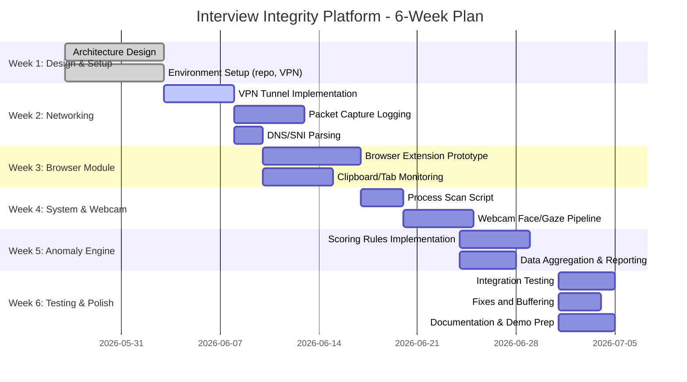

# Session-Based Interview Integrity Platform (Privacy-Aware Design)

## Executive Summary  
This design describes a secure, privacy-conscious remote interview proctoring system that creates a temporary, encrypted session tunnel and monitors multiple behavior layers to detect cheating. Each interview launches a unique VPN/proxy tunnel (e.g. WireGuard/OpenVPN) with ephemeral credentials, routing all candidate traffic through a controlled gateway. We log metadata (DNS queries, SNI, IPs, packet sizes/timings, WebSocket frames) and apply content inspection (e.g. mitmproxy for HTTP) to reveal illicit flows, constrained by TLS (only headers/SNI are visible【53†L340-L349】). On the client side we monitor browser activity (focus, URL, clipboard) and system state (running processes, VM/detach tools) using lightweight APIs (e.g. browser extension or Electron) and Python libraries (e.g. psutil【33†L246-L254】). The webcam feed is analyzed via OpenCV/MediaPipe (face landmarks and head-pose【28†L74-L82】) to measure gaze/attention. All streams feed an anomaly engine: first rule-based (e.g. suspicious tab switches, flagged sites, rapid answer typing) and later ML-based once labeled data is available【47†L33-L41】. The output is a structured report of events/timings for human review. Data is logged compactly (timestamped events) with strong encryption and minimal retention (per GDPR guidelines【8†L679-L687】【8†L690-L695】). The architecture is modular and uses open-source/free-tier components (e.g. free VPN software, mitmproxy, PyShark, Scapy, OpenCV, SQLite) to suit a hackathon budget.

## Threat Model and Adversarial Behavior  
We assume a well-resourced candidate may use both hardware and software cheats. Common threats include:  
- **AI Overlay Assistants:** Invisible tools like Cluely place a transparent window on top of the screen to display AI-generated answers in real time【49†L88-L97】. They “listen” to audio or screen content and reply via hidden shortcuts, bypassing normal keyboard logging and appearing only on the candidate’s monitor【49†L122-L130】.  
- **Remote Takers / Proxy Testers:** A hired test-taker logs in remotely (sometimes via SSH/VPN) or shares credentials; concurrent logins or IP changes can reveal this. Proctor systems already track IP and login events【10†L225-L232】.  
- **Undesirable Applications:** Programs like ChatGPT desktop apps, virtual machines, remote-desktop tools, or smartphone helper apps provide outside information. For example, proctoring browsers scan for 400+ known remote-access or VM processes【10†L217-L220】.  
- **Screen Sharing and Copy/Paste:** Cheaters might try copy-paste via clipboard or external devices (phones). We must monitor clipboard events and block unauthorized applications. The secure browser approach (Guardian Browser) blocks alt-tabs and logs attempted copy/paste【10†L195-L203】.  
- **Social Engineering:** The candidate may allow a friend to answer; this is countered by requiring secure login and monitoring biometrics (face/voice match) and network presence.  

In short, we expect hidden AI answers, unauthorized software on the client, off-screen communication, and attempts to evade detection. The system will treat unusual patterns (rapid answer shifts, extra processes, unexpected URLs, gaze away from screen) as suspicious and flag them for manual review.  

## Session Tunnel and Observable Metadata  
Each interview creates a temporary VPN/proxy tunnel to funnel all network traffic.  Observable metadata includes:  
- **DNS Queries and SNI:** The candidate’s DNS lookups (or DNS-over-HTTPS hostnames) and TLS Server Name Indication headers are logged. By RFC 6066, the SNI (the target hostname in TLS ClientHello) is sent in cleartext【53†L340-L349】, revealing which host the candidate is contacting even if content is encrypted. DNS requests may be logged unless DoH/DoT is used.  
- **IPs and Ports:** The gateway sees destination IP addresses and ports for all outgoing connections. Unusual destinations (e.g. odd domains or VPN services) can be blocked or flagged.  
- **Traffic Patterns:** Packet sizes, timing, and direction are observable even under TLS. We can note bursts of traffic (e.g. when large files are uploaded) and volume changes. WebSocket frames are encrypted but their lengths and timing can show interactive use of web-based assistants. Metadata extraction is done in real time using packet capture libraries. Content inside TLS is not visible without active interception (e.g. mitmproxy with a trusted cert); by default only headers and handshake data are available.  
- **Limiting Factors:** We cannot see the actual exam content if it’s HTTPS/TLS (without a MITM proxy). In practice, we may use an intercepting proxy (mitmproxy) with the user’s consent to inspect HTTP requests/responses, but this raises privacy concerns. For telemetry, we focus on passively-available metadata (DNS, SNI, timing).  

## Capture Tools and MVP Stack  
We recommend open-source and free-tier components:  
- **VPN/Tunnel:** WireGuard or OpenVPN for the secure tunnel. WireGuard is modern, simple (kernel-based, key auth, high performance)【12†L8-L15】. OpenVPN is a mature SSL/TLS VPN supporting many platforms and cert/2FA auth【16†L59-L67】. For a hackathon, WireGuard’s simplicity is attractive. An alternative is SSH with dynamic port forwarding (SOCKS5), which is easy but less scalable.  
- **Intercepting Proxy:** Mitmproxy (Python) can intercept HTTP/S flows if we install its CA; useful for debugging or detecting WebSocket/HTTP API use. Otherwise a raw VPN only passes encrypted streams.  
- **Packet Capture:** We can use TShark (Wireshark’s CLI) or tcpdump for raw packet capture. In Python, PyShark (wrapper over TShark) allows programmatic packet analysis【18†L58-L62】. Scapy provides a flexible packet sniffing and forging library【23†L53-L62】. For real-time filtering of DNS, SNI, etc., PyShark or libpcap hooks work. Tools like tcpdump are free and efficient for logging, but do not parse higher-level fields automatically.  
- **Browser Integration:** Either a browser extension (e.g. Chrome extension) or an Electron-based custom app can monitor tabs and clipboard. Chrome’s `chrome.tabs` API allows extensions to query the active tab’s URL and title (with permission)【35†L279-L288】. Extensions are free to distribute but require user consent. An Electron wrapper can embed a controlled browser session and give Node.js access to OS-level APIs (process list, etc.). Both approaches are free-technology.  
- **System Monitoring:** On the client machine, we can use cross-platform libraries. For example, Python’s psutil (BSD/MIT license) enumerates running processes and system info on Windows, Linux, macOS【33†L246-L254】. OS-specific APIs (WMI on Windows, `ps`/`top` on Linux) could also be used via subprocess calls.  
- **Machine Learning:** If needed later, libraries like scikit-learn or TensorFlow (all open-source) can implement the anomaly engine. Domain classification could optionally use free-tier threat-intel APIs (e.g. VirusTotal, DNSlytics with free tiers【40†L527-L535】【40†L551-L559】) to check if visited domains are malicious.  
- **Data Storage:** Use a simple database (SQLite, JSON) or in-memory buffers to log events per session. Results can later be stored in a lightweight encrypted database or in-memory until session end. This avoids cloud costs.  

## Module Implementation

### Network/Session Monitoring  
- **Session Tunnel Lifecycle:** On interview start, spin up a VPN interface or SOCKS proxy with short-lived keys. Each interview gets unique credentials or JWTs, invalidated at end. The gateway enforces that only the tunnel is used (we can push firewall rules to drop other egress). On session end, automatically tear down the tunnel and revoke credentials.  
- **Data Collection:** Use libpcap/TShark (via PyShark) on the gateway to capture metadata. Log DNS query records (from the DNS resolver logs or packet analysis) and TLS handshakes (extract SNI hostnames【53†L340-L349】). Log packet metadata: timestamp, size, source/dest IP, protocol, and counts of TCP/UDP/SYN flags. For WebSocket or HTTP traffic (if intercepted), parse the high-level frames for keywords or patterns (this requires a MITM proxy with its certificate installed).  
- **Sampling & Buffering:** We can capture every packet header but may aggregate to reduce volume (e.g. count bytes per domain every second). Use ring buffers for rolling logs (only last N minutes) to limit memory. Batch logs (JSON or CSV) and flush every few seconds to a file or a message queue. Domain names should be cached (via a dict) to avoid repeated lookups and speed logging.  

### Browser Activity Monitoring  
- **Tab/URL Tracking:** Via a browser extension or Electron’s webview, listen for `tabs.onActivated` or focus events. Record when the interview tab becomes unfocused or switched (and to which domain). If out-of-browser pages are visited, that may indicate cheating. The extension can report the current URL and title at intervals or on change.  
- **Clipboard Monitoring:** Direct clipboard access is restricted (needs user action). Older extensions had to poll `navigator.clipboard.read()`, which is inefficient【25†L178-L186】. Chrome is introducing a `clipboardchange` event to reduce polling overhead【25†L144-L152】. For now we can periodically check or hook into paste events. If a paste happens (with an allow-listed "Paste" event), we log it. Text snapshots of pastes can also be scanned for references to solution sites.  
- **Copy/Paste Blocking:** If the policy forbids copy/paste, the extension can intercept and cancel paste events or the “Copy” command. This follows practices from secure exam browsers (e.g. copying is disabled【10†L195-L203】).  
- **Browser Permissions:** The extension requires permission to read tab URLs (`tabs` and host permissions)【35†L279-L288】. It may also require permissions for context menu (to block) and clipboard API. All these APIs are free in modern browsers but must be declared.  

### System/Process Monitoring  
- **Process Scanning:** Periodically (e.g. every 30 seconds) enumerate running processes via a cross-platform library (psutil) or system call. Look for forbidden software (Zoom, Slack, other browsers, debugger tools, virtual machines). For example, many proctoring systems scan for VM executables and remote-desktop tools【10†L217-L220】. Keep a list of blacklisted process names (student’s installer or known cheat apps) and log any matches.  
- **Hardware Checks:** If feasible, detect USB devices or multiple monitors. Many secure browsers ask the user to disconnect extra displays【10†L210-L218】. A lightweight check could enumerate display adapters or prompt via the secure browser.  
- **Clipboard and Other Signals:** Similarly, the system module can listen for global hotkeys or clipboard events at the OS level (if running in Electron/Node). Alternatively, rely on the browser extension for web context only.  

### Webcam (OpenCV) Pipeline  
- **Face & Landmarks Detection:** Using OpenCV or MediaPipe, capture video frames (5–15 FPS) from the webcam. First detect the presence of a face (e.g. Haar cascade or DNN). For each detected face, run a face-landmark model (MediaPipe FaceMesh【28†L74-L82】) to get eyes, nose, and mouth positions.  
- **Gaze and Attention:** Compute eyeball/gaze direction by comparing pupil (or iris) location within the eye region, or by head pose estimation. Solve the 3D pose (PnP) using a generic 3D face model and 2D landmarks (nose tip, eye corners, mouth corners)【30†L128-L136】. From pose (yaw, pitch) we infer if the candidate is looking away. Log events when gaze is off-screen for too long. Smoothing filters (Kalman) can reduce noise.  
- **False-Positive Mitigation:** Short blinks and normal glances should not trigger alerts. We use thresholds (e.g. >2 sec away) and combine with context (if they look away while thinking silently, it’s ambiguous). An explicit "look away" flag is only set if head/gaze remains turned for several seconds.  
- **Facial Recognition / Consistency:** Optionally, detect if the face in frame matches the login photo or remains in front of screen. However, privacy concerns and research accuracy make face recognition optional.  

### Typing and Input Monitoring  
- **Keystroke Patterns:** While we will not log actual keystrokes (privacy), we can measure typing speed by counting key events. Unusually fast paste/typing bursts (copying solution text) can be flagged.  
- **Hidden Shortcuts:** Cheat tools may use hotkeys to hide their UI【49†L122-L130】. We can detect global hotkey presses or unconventional key patterns via a local helper. If a suspicious hotkey sequence is used, log it. However, this is intrusive and may violate OS security; we focus on browser-allowed events.  

## Anomaly Detection Engine  
The anomaly engine fuses all signals into a ranked report rather than an opaque score:  
- **Rule-Based Alerts:** Start with deterministic rules. For example: switching away from the interview tab to a blocked site (e.g. Google search) is immediate cause for flag; domain reputation (from DNSlytics/VirusTotal free API) can flag known cheating sites. Looking away from the screen while typing an answer is suspicious. Shortcuts that bypass logging (like a paste event not captured by browser) are flagged. Each event type is weighted.  
- **Signal Correlation:** Combine related signals. E.g., if network logs show a WebSocket to an AI API at the same time as a hidden clipboard paste, escalate the suspicion. If the webcam shows eyes off-screen while a paste occurs, correlate them.  
- **Scoring:** Assign each event a score and sum them with weights (tunable). Events could include “tab change”, “clipboard paste”, “unknown process launch”, “face out of frame”, etc. Set a threshold for “review needed.”  
- **Machine Learning (Future):** Once labeled data (normal vs cheat sessions) is available, we can train models. Unsupervised methods (like Isolation Forest or clustering) could flag outliers in multi-dimensional feature space【47†L33-L41】. Supervised classifiers (SVM, random forest) could learn patterns of cheating. We should initially collect data to support later ML. Evaluation metrics would include precision, recall, and false-positive rate. Cross-validation ensures the model doesn’t unfairly target, e.g., certain accents or behaviors.  
- **Human-Readable Report:** The output is a timeline log of events (see Data Schema) with explanations, not a single score. For example: “00:05:12 – Tab switched to `stackoverflow.com`; 00:05:40 – pasted from clipboard; 00:06:05 – face turned away for 5s.” This allows human reviewers to make informed decisions.  

## Data Schema and Event Logging  
We propose a compact event log schema (JSON or CSV table) with entries like:  

| Timestamp           | Source   | Event Type        | Details                     |
|---------------------|----------|-------------------|-----------------------------|
| 2026-05-25T10:00:05 | Network  | DNS Query         | domain=cheatsite.com        |
| 2026-05-25T10:00:05 | Network  | TLS Connect       | SNI=api.openai.com          |
| 2026-05-25T10:00:12 | Browser  | Tab Switched      | from=interview.test to=github.com |
| 2026-05-25T10:00:15 | Input    | Clipboard Paste   | contentHash=abcd1234        |
| 2026-05-25T10:00:20 | Webcam   | Gaze Away         | duration=4s                 |

Each log record includes a timestamp, the module (Network/Browser/Input/Webcam), event type, and minimal details (e.g. domain name, target URL, or duration). Sensitive data (e.g. exact paste text) should be hashed or omitted for privacy. The schema is schema-less (JSON array) or a fixed CSV/SQL table as above. Only high-level metadata is stored; raw video or keystrokes are not saved. Logs should be encrypted at rest and transmitted securely (e.g. TLS to a server) if needed.  

## Browser Integration Options  
Two main approaches:  

- **Browser Extension:** A Chrome/Firefox extension can monitor the interview tab and intercept browser events. Pros: easy to distribute to users with a download link; it runs on any OS with the browser; it can block or log navigation, clipboard, and active tab with granted permissions【35†L279-L288】. Cons: It cannot see outside the browser (e.g. other apps), and installation requires user permission. It also cannot enforce network routing (that is handled by the tunnel).  
- **Electron/Desktop App:** Build a custom interview client using Electron (which bundles Chromium + Node.js). Pros: Full control over the environment – you can disable other browser windows, directly monitor OS processes (via Node’s `child_process`/`psutil`), and pack the VPN credentials. It can present the interview in a kiosk mode. Cons: Bulkier to develop, higher initial setup, and requires installing a desktop app. Also must be cross-compiled per OS.  
- **Trade-offs:** Extensions are lightweight and cross-platform (Chrome on Windows/Mac/Linux), but limited to browser context. Electron apps give richer system access but at the cost of development effort. For a quick MVP, a browser extension plus a separate background agent (psutil script) might suffice.  

## Performance and Scalability  
- **Sampling:** Network packets can be high-volume; we should filter at capture to relevant packets only (e.g. DNS, TCP handshake, TLS ClientHello). Continuous deep capture is resource-heavy. For scalability, we keep metrics (bytes per domain, number of connections, etc.) rather than storing all packets.  
- **Buffers:** Use circular buffers or queues to limit memory for video frames or event logs. For example, only keep the last 10 seconds of face pose data at high resolution, summarize older data.  
- **Domain Caching:** Cache DNS resolution and domain categories in-memory to avoid repeated lookups or API calls.  
- **Batching and Delays:** Batch log uploads (if sending to a server) to reduce I/O. E.g. send an aggregated JSON per minute.  
- **Latency:** All monitoring should be near real-time (<1 sec) so proctors can intervene. Use asynchronous processing threads: one thread for capture, one for video processing, one for logging/analysis.  
- **Resource Constraints:** All components chosen (OpenVPN/WireGuard, mitmproxy, OpenCV) run on modest hardware. For a hackathon, a single 2–4 vCPU cloud instance or a laptop can handle a few simultaneous sessions. We can start with one session per process to simplify.  

## Privacy, Security and Legal Considerations  
- **Consent and Transparency:** Before each session, explicitly obtain the candidate’s consent for monitoring. Explain what data is collected (e.g. “We log domains visited, webcam video, and system processes for integrity checks”). Give a privacy notice (like GDPR requires【8†L679-L687】【8†L690-L695】).  
- **Minimal Data Retention:** Store only what is necessary. Raw video should only feed into live analysis and not be saved permanently. Logs older than needed (e.g. after report generation) should be purged. Anonymize data where possible (e.g. replace IP addresses with hashes).  
- **Encryption:** All sensitive data (video frames, logs) must be encrypted in transit (TLS) and at rest. SSH certificates or WireGuard keys should be ephemeral. Use secure random tokens for session IDs.  
- **Access Controls:** Ensure only authorized interviewers/proctors can see reports. No 3rd-party cloud services without vetting (use open-source/self-hosted where possible).  
- **Fairness and Bias:** Be careful not to over-flag benign behaviors. For example, people with certain attention styles or disabilities might look away more; consider moderation. As one study notes, simple gaze-detection proctoring has false positives【8†L701-L708】.  
- **Legality:** Follow applicable laws. If operating across borders, comply with data protection regimes (GDPR, etc.)【8†L679-L687】【8†L690-L695】. Only monitor within the scope of the interview (e.g. do not scan unrelated personal documents).  

## Implementation Checklist & MVP Feature List  
- **Secure Tunnel:** Set up a VPN/proxy for the session (WireGuard config, server startup). Use ephemeral keys tied to session ID. (Free tier: host on a free AWS/GCP instance or local test server.)  
- **Network Logging:** Implement passive packet capture for DNS/SNI (using PyShark or tcpdump). Log domains and IPs with timestamps.  
- **Browser Monitoring:** Create a Chrome extension that (with permission) logs URL changes and prohibits disallowed navigation. Implement clipboard event logging or blocking.  
- **Process Monitoring:** Integrate a background script (e.g. Python with psutil) that periodically lists running processes and reports matches to blacklist.  
- **Webcam Analysis:** Integrate OpenCV/MediaPipe. Capture camera frames, detect face landmarks, compute and log head pose/gaze. Ensure it runs at ~10–15 FPS with CPU-only (free).  
- **Anomaly Scoring:** Write basic rules (Python or JS) to assign points for events (tab switch, paste, gaze-away, blacklisted process). Generate a timestamped report object.  
- **Data Retention:** Design an ephemeral logging scheme (e.g. in-memory JSON) and test that all data is encrypted at rest/in-flight.  
- **Dashboard/Report:** Provide a simple web or console output that shows the ordered list of flagged events for the interviewer.  
- **Privacy Safeguards:** Prompt for consent at start; ensure logs omit personal content (e.g. store only domain names, not full query text).  

MVP features (minimum viable): 
1. **Session Tunnel established** with unique credentials (free open-source VPN).  
2. **Network metadata capture** (DNS/SNI, IPs) and **browser extension** logging URLs.  
3. **Process scan** for unauthorized apps (using psutil).  
4. **Webcam capture** with basic face detection and gaze flagging (OpenCV/MediaPipe).  
5. **Anomaly report** listing all events with time stamps.  

These suffice for a hackathon demo; future improvements (ML training, advanced analytics, distributed scaling) can be added later.

## 6-Week Development Timeline  

## Comparison Tables

### Proxy/Tunnel Options  
| Tool          | Type        | Encryption | Platform Support             | Auth Method         | Notes                        |
|---------------|-------------|------------|------------------------------|---------------------|------------------------------|
| **WireGuard** | VPN (L3)    | ChaCha20   | Linux (kernel), Windows, Mac | Public-key (Curve25519) | Fast, simple config【12†L8-L15】 |
| **OpenVPN**   | VPN (L2/3)  | TLS/SSL    | Linux, Windows, Mac, BSD     | Certs/Username+Pass/2FA【16†L59-L67】 | Full-featured but heavier  |
| **SSH SOCKS5**| Proxy       | SSH        | All (any SSH client)         | Password/key        | Easy to set up (ssh -D), single-host |
| **Mitmproxy** | HTTP(S) proxy | TLS or None | Cross-platform (Python)    | Configurable CA     | Can decrypt HTTPS if cert installed |
| **SOCKS5 Proxy** | Proxy    | None/TLS   | Cross-platform               | None or simple auth | Simple proxy (e.g. Dante), no encryption by default |

### Packet-Capture Tools  
| Tool              | Interface    | Language     | Live/Offline | Filtering      | Free/Open Source |
|-------------------|--------------|--------------|--------------|----------------|------------------|
| **TShark**        | CLI/GUI      | C            | Both         | Built-in (display filters) | Free (GPL)       |
| **Wireshark**     | GUI          | C            | Offline      | GUI filters    | Free             |
| **PyShark**       | Library      | Python       | Both         | Uses TShark filters | Free (MIT)       |
| **tcpdump**       | CLI          | C            | Live         | libpcap filters | Free (BSD)       |
| **Scapy**         | Library      | Python       | Both         | Custom scripting (Python) | Free (BSD)     |
| **pcapy/WPCAP**   | Library/API  | C/Python     | Live         | Dependent on libpcap | Free         |

### Browser Integration Approaches  
| Approach               | Level               | Pros                                              | Cons                                               |
|------------------------|---------------------|---------------------------------------------------|----------------------------------------------------|
| **Browser Extension**  | In-browser (JS)     | Easy deployment; cross-OS; monitors tabs/URL【35†L279-L288】 | Can’t see outside browser; requires user install  |
| **Electron App**       | Desktop (Node+Chromium) | Full OS access (processes, file) and UI control | Heavier to build; larger install; cross-compile needed |
| **Native Web App**     | Web only            | No install; runs in browser sandbox              | No access to OS or other apps; limited permissions |

**Sources:** Official docs and recent studies were used for this design. For example, WireGuard’s design paper【12†L8-L15】 and OpenVPN docs【16†L59-L67】 inform tunnel choice; PyShark and Scapy docs【18†L58-L62】【23†L53-L62】 describe packet analysis capabilities; Chrome extension docs【35†L279-L288】【25†L178-L186】 explain browser APIs; proctoring reports【10†L183-L190】【8†L701-L708】 illustrate real-world telemetry and fairness issues; and MediaPipe docs【28†L74-L82】 guide the webcam pipeline. The event schema and rule logic follow common logging practices, prioritizing user privacy and minimal data retention. All recommended tools have free tiers or open-source licenses, consistent with a hackathon and privacy requirements.